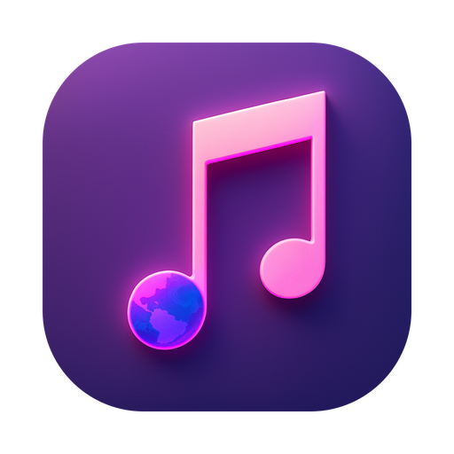
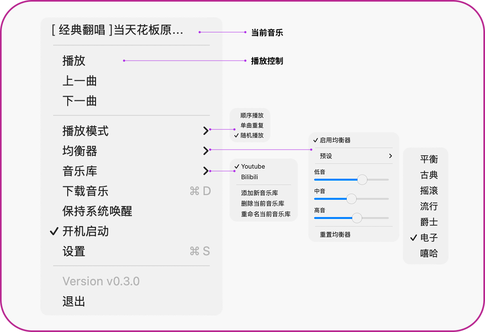
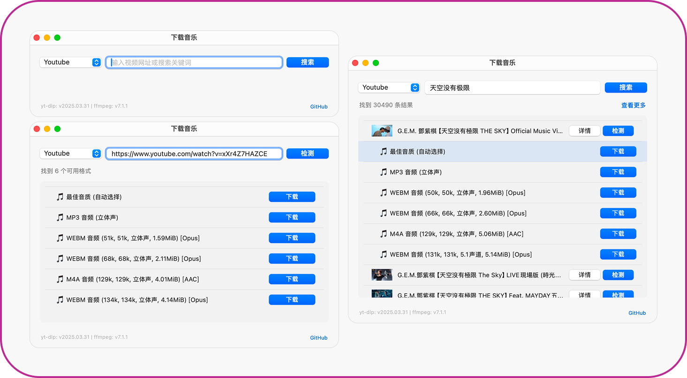

# MacMusicPlayer

<div align="center">
  
  <br />
  <div id="download-section" style="margin: 20px 0;">
    <a href="#" onclick="downloadLatest(); return false;" style="text-decoration: none;">
      
    </a>
  </div>
  <p>An elegant and minimalist music player for macOS, designed as a menu bar application to provide a seamless music playback experience.</p>
  <p>
    <a href="https://github.com/samzong/MacMusicPlayer/releases"></a>
    <a href="https://github.com/samzong/MacMusicPlayer/blob/main/LICENSE"></a>
    <a href="https://deepwiki.com/samzong/MacMusicPlayer"></a>
  </p>
</div>

## Installation

### Homebrew (Recommended)

```bash
brew install samzong/tap/mac-music-player
```

### DMG

Download the latest `MacMusicPlayer.dmg` from the [Releases](https://github.com/samzong/MacMusicPlayer/releases) page.

> **Security Note**: If you encounter a security warning on first launch, right-click the app and select "Open", or run: `xattr -dr com.apple.quarantine /Applications/MacMusicPlayer.app`

## Features

- 🎵 Lightweight menu bar player for instant music control
- 🎨 Native macOS interface with perfect light/dark theme support
- 🌍 Multi-language support (English, Chinese, Japanese, Korean)
- 🔎 Command+F song picker with instant filename filtering
- 🎧 Audio format support (mp3, m4a, wav, flac, aac, aiff, etc.)
- 🔄 Multiple playback modes (Sequential, Single Loop, Random)
- 📚 Multiple music libraries with quick switch/refresh/rename
- 📥 Built-in YouTube search & playlist downloads with format selection (requires yt-dlp + ffmpeg)
- 💾 Smart memory of last music folder location
- 🚀 Launch at login support
- 🌙 Prevent-sleep toggle and configurable song picker on launch
- ⌨️ Media key control support

## Configuration & Tips

- Install dependencies for downloads: `brew install yt-dlp ffmpeg`.
- Configure API URL and API Key in **Settings** to enable the built-in YouTube search service.
- Pick the destination library in the Download window; use **Download All** for playlists or **Refresh Current Library** to rescan music quickly.

## Screenshots

### Menu Items



### Download Music



## Contributing

Contributions are welcome! Please feel free to submit Issues and Pull Requests.

## License

This project is licensed under the MIT License - see the [LICENSE](LICENSE) file for details.
