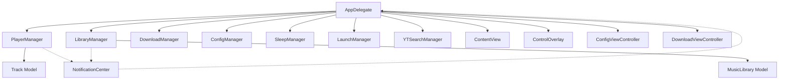

# Component Architecture

Detailed breakdown of MacMusicPlayer's modular component design and relationships.

## 🏗️ Component Overview

MacMusicPlayer uses a **Manager-based architecture** where each manager handles a specific domain of functionality. This promotes loose coupling, testability, and maintainability.



## 🎛️ Manager Components

### PlayerManager
**File**: `Managers/PlayerManager.swift`  
**Responsibility**: Audio playback, equalizer, and playback state management

```swift
class PlayerManager: NSObject, ObservableObject, AVAudioPlayerDelegate {
    // Core playback state
    @Published var playlist: [Track] = []
    @Published var currentTrack: Track?
    @Published var isPlaying = false
    
    // Audio engine components
    private var player: AVAudioPlayer?
    var audioEngine: AVAudioEngine!
    var playerNode: AVAudioPlayerNode!
    
    // Equalizer system
    private var bassEQ: AVAudioUnitEQ!
    private var midEQ: AVAudioUnitEQ!
    private var trebleEQ: AVAudioUnitEQ!
}
```

**Key Features**:
- Dual audio system: `AVAudioPlayer` for simple playback + `AVAudioEngine` for EQ
- Reactive UI updates via `@Published` properties
- Persistent EQ settings in UserDefaults
- Media key integration via MediaPlayer framework

**Dependencies**:
- **Models**: Track
- **Frameworks**: AVFoundation, MediaPlayer
- **Storage**: UserDefaults for EQ settings

---

### LibraryManager
**File**: `Managers/LibraryManager.swift`  
**Responsibility**: Music library CRUD operations and multi-library support

```swift
class LibraryManager: ObservableObject {
    @Published var libraries: [MusicLibrary] = []
    @Published var currentLibrary: MusicLibrary?
    
    // Core operations
    func addLibrary(name: String, path: String)
    func removeLibrary(id: UUID)
    func switchLibrary(id: UUID)
    func renameLibrary(id: UUID, newName: String)
}
```

**Key Features**:
- Multiple library support with metadata tracking
- Automatic library persistence via UserDefaults
- Legacy single-library migration support
- Last-used library restoration

**Data Flow**:
```
User selects folder → LibraryManager.addLibrary() → 
Save to UserDefaults → Notify PlayerManager → UI updates
```

---

### DownloadManager
**File**: `Managers/DownloadManager.swift`  
**Responsibility**: External tool integration for online music downloads

```swift
public class DownloadManager {
    public static let shared = DownloadManager()
    
    // External tool verification
    func checkYTDlpAvailability() throws -> String
    func checkFFmpegAvailability() throws -> String
    
    // Download operations
    func fetchAvailableFormats(for url: String) async throws -> [DownloadFormat]
    func download(url: String, format: DownloadFormat, libraryId: UUID) async throws
}
```

**Key Features**:
- Process-based execution of yt-dlp and ffmpeg
- Async/await support for modern concurrency
- Format detection and selection
- Playlist batch download support

**Security Considerations**:
- Path validation for external tools
- Controlled argument passing to prevent injection
- Error handling for missing dependencies

---

### ConfigManager
**File**: `Managers/ConfigManager.swift`  
**Responsibility**: Application settings and API configuration

```swift
class ConfigManager {
    static let shared = ConfigManager()
    
    var apiKey: String { get set }
    var apiUrl: String { get set }
    var isConfigValid: Bool { get }
}
```

**Key Features**:
- Centralized configuration management
- UserDefaults-based persistence
- Configuration validation

**⚠️ Security Note**: API keys stored in UserDefaults (plaintext). Consider migrating to Keychain Services for production.

---

### System Integration Managers

#### SleepManager
**Responsibility**: Prevent system sleep during playback
```swift
class SleepManager: ObservableObject {
    @Published var preventSleep: Bool = false
}
```
- Uses IOKit for power assertion management
- Automatically manages sleep prevention state

#### LaunchManager  
**Responsibility**: Launch-at-login functionality
```swift
class LaunchManager: ObservableObject {
    @Published var launchAtLogin: Bool = false
}
```
- Uses ServiceManagement framework
- Registers/unregisters login items

#### YTSearchManager
**Responsibility**: Online music search API integration
```swift
class YTSearchManager {
    func search(keyword: String, pageToken: String? = nil, 
               completion: @escaping (Result<SearchResult, Error>) -> Void)
}
```
- HTTP API client for music search
- Pagination support for large result sets

## 📱 View Components

### SwiftUI Views

#### ContentView
**File**: `Views/ContentView.swift`  
**Purpose**: Main playback interface for popover/window display

```swift
struct ContentView: View {
    @EnvironmentObject var playerManager: PlayerManager
    
    var body: some View {
        VStack {
            // Track info display
            // Playback controls
        }
    }
}
```

**Design Pattern**: Pure presentation layer, all logic delegated to PlayerManager

#### ControlOverlay
**File**: `Views/ControlOverlay.swift`  
**Purpose**: Floating playback controls

**Features**:
- Overlay-style interface
- Minimal footprint
- Gesture-based interactions

### AppKit Controllers

#### ConfigViewController
**File**: `Controllers/ConfigViewController.swift`  
**Purpose**: Settings window for API configuration

```swift
class ConfigViewController: NSViewController {
    // Form controls for API settings
    // Validation and persistence logic
}
```

**Why AppKit**: Complex forms and validation logic better suited to AppKit than SwiftUI

#### DownloadViewController
**File**: `Controllers/DownloadViewController.swift`  
**Purpose**: Download interface with format selection and progress tracking

```swift
class DownloadViewController: NSViewController {
    // URL input and validation
    // Format detection table
    // Progress indicators
    // Tool version status
}
```

**Features**:
- Real-time format detection
- Batch download progress tracking
- External tool status monitoring

## 🔗 Component Communication

### Notification-Based Messaging

MacMusicPlayer uses `NotificationCenter` for loose coupling between components:

```swift
// Standard notifications
"TrackChanged"           // PlayerManager → UI components
"PlaybackStateChanged"   // PlayerManager → AppDelegate (menu updates)
"RefreshMusicLibrary"    // LibraryManager → PlayerManager
"AddNewLibrary"          // UI → LibraryManager
"ConfigUpdated"          // ConfigViewController → other components
```

### Communication Patterns

#### 1. Manager → UI Updates
```swift
// In PlayerManager
@Published var currentTrack: Track? {
    didSet {
        NotificationCenter.default.post(name: NSNotification.Name("TrackChanged"), object: nil)
    }
}

// In AppDelegate
NotificationCenter.default.addObserver(
    self, selector: #selector(updateMenuItems), 
    name: NSNotification.Name("TrackChanged"), object: nil
)
```

#### 2. Cross-Manager Communication
```swift
// LibraryManager notifies PlayerManager of library changes
NotificationCenter.default.post(name: NSNotification.Name("RefreshMusicLibrary"), object: nil)

// PlayerManager responds by reloading tracks
NotificationCenter.default.addObserver(/* refresh handler */)
```

#### 3. UI → Manager Actions
```swift
// Direct method calls for immediate actions
@objc func togglePlayPause() {
    playerManager.isPlaying ? playerManager.pause() : playerManager.play()
}
```

## 🎯 Data Models

### Track Model
**File**: `Models/Track.swift`

```swift
struct Track: Identifiable {
    let id: UUID
    let title: String
    let artist: String  
    let url: URL
}
```

**Design Decisions**:
- Immutable struct for thread safety
- URL-based file references for security
- Minimal metadata for performance

### MusicLibrary Model
**File**: `Models/MusicLibrary.swift`

```swift
struct MusicLibrary: Identifiable, Codable {
    let id: UUID
    var name: String
    var path: String
    var createdAt: Date
    var lastAccessed: Date
}
```

**Features**:
- Codable for UserDefaults persistence
- Timestamp tracking for usage analytics
- Mutable properties for library management

## 🔄 Lifecycle & State Management

### Application Lifecycle
```
1. AppDelegate.applicationDidFinishLaunching()
   ├── Initialize all managers
   ├── Setup menu bar interface  
   ├── Configure notification observers
   └── Load last-used library

2. Manager Initialization
   ├── PlayerManager: Setup audio engine
   ├── LibraryManager: Load saved libraries
   ├── ConfigManager: Load API settings
   └── Other managers: Restore state

3. Runtime Operation
   ├── UI events → Manager methods
   ├── Manager changes → NotificationCenter
   └── NotificationCenter → UI updates
```

### State Persistence

**PlayerManager State**:
- EQ settings → UserDefaults
- Playback mode → UserDefaults
- Current track position → Memory only

**LibraryManager State**:  
- Library list → UserDefaults (JSON encoded)
- Current library ID → UserDefaults
- Track scanning → Runtime only

**ConfigManager State**:
- API credentials → UserDefaults (⚠️ security concern)
- Settings validation → Runtime

## 🧪 Testing Architecture

### Manager Testability

Each manager is designed to be testable in isolation:

```swift
// Example: PlayerManager testing
class MockPlayerManager: PlayerManager {
    override func play() {
        // Mock implementation for testing
        isPlaying = true
    }
}
```

**Testable Patterns**:
- Dependency injection via initializers
- Protocol-based interfaces (future enhancement)
- Observable state via `@Published` properties

### Component Isolation

**Benefits of Manager Architecture**:
- **Unit Testing**: Test each manager independently
- **Integration Testing**: Test manager interactions via notifications
- **UI Testing**: Mock managers for predictable UI state

---

This component architecture provides a solid foundation for maintainable, testable, and extensible macOS application development while following platform conventions and best practices.